**!!!!! DANS L'ORDRE !!!!!**

# 1. (Safe/Offline) Windows

1. **Copier/Coller tout le contenu de la clé sur Windows SUR LA RACINE D'UN DISQUE E:\\ ou D:\\**
   NE PAS OUBLIER D'ELIMINER LES TRACES A LA FIN !!!!!

2. **Extraire le cours de CPP (*CPP.zip*) pour obtenir le Makefile**
   La structure du programme est :
   
   ```txt
   project_folder/   <-- Ouvrir ce dossier VSCode
   |- bin/
   |- obj/
|- src/
   |  |- main.cpp
   |  |- class1.cpp
   |  |- class1.h
   |  |- <codes.cpp>
   |  |- <headers.h>
   |- Makefile
   ```
   
   Pour compiler : 
   
   ```sh
   make
   ```
   
   **Il se peut que des "flags" (`-Wstrack-protector` par exemple) n'existent pas dans le Makefile. Il faut donc les enlever dans le Makefile !**
   
   **En cas de doute, remplacez `CXXFLAGS = ... (ligne complète)` par `CXXFLAGS = -g -Wall -Wextra`**
   
   Pour lancer le programme : `./bin/executable`
   
3. **Extraire le contenu de `reference.zip` pour obtenir les References en CPP (english only)**

4. Extraire le CONTENU de `VSCode-win32-x64-1.52.1.zip` dans le dossier `vscode`.

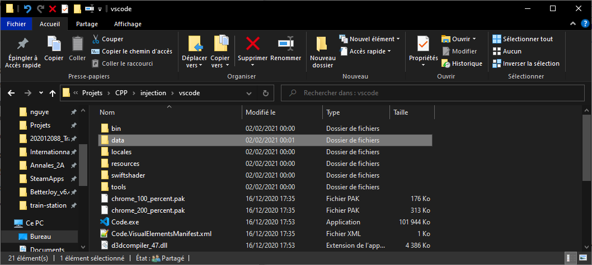

​	Lancer `Code.exe` pour lancer VSCode.

# 2. (Unsafe/Online) VM

### Prendre un instantané pour le restaurer à la fin

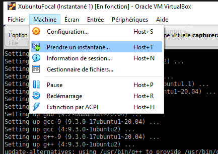

## (Safe 95%) Installer un formatter

1. `sudo apt update`

2. `sudo apt install clang-format `

   Pour exécuter le formatter : `./clang-format [fichier.c]`

# 3. Backdoor

## (Safe 60%) Installer une backdoor/serveur SSH et injecter VSCode dans la VM pour du Remote

Le setup d'un serveur ssh est extrêmement discret et ne se lance jamais automatiquement. De plus, aucune trace ne peut être détecté. **Cependant, les manipulations requiert une concentration et un calme absolu ! (Déstresse !)**

0. **Prérequis : Sur Windows, Git doit être installé !!!** 

2. (**Linux/VM**) Installer un serveur openssh

   ```sh
   sudo apt install openssh-server
   ```

2. (**Linux/VM**) Lancer le server et désactivez le parefeu:

   ```sh
   sudo service sshd start
   sudo ufw disable
   ```

4. (**Windows**) Sur **Virtualbox**, **Dans les paramètres de la VM :**

   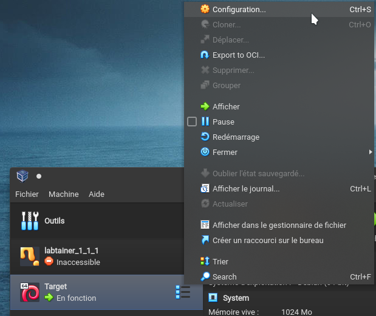
   
   **Ajouter une redirection de port TCP (host:5678 vers guest:22):**

   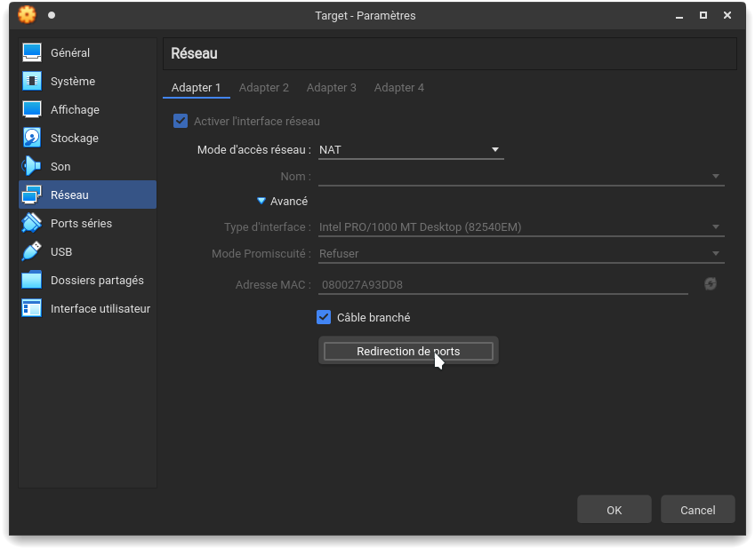

   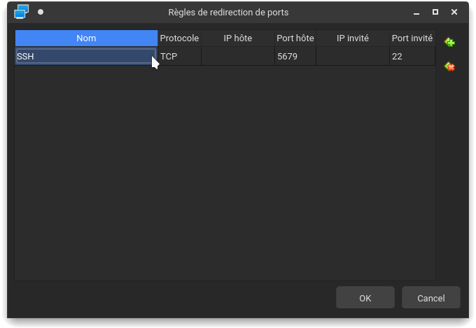
   
4. **(Windows)** Testez la connexion ssh : 

   ```ssh
   ssh eleve@localhost -p 5679
   ```

   Mot de passe : **eleve**

5. **(Windows/VSCode)** Sur **le VSCode de Windows**, créer une nouvelle connexion ssh.

   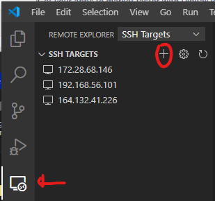

   ```sh
   ssh eleve@localhost -p 5679
   ```

   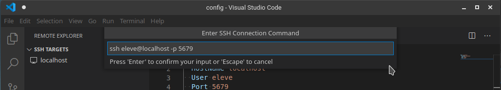

6. **(Windows/VSCode)** Se connecter avec VSCode :  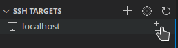

   Mot de passe : **eleve**

7. **VOUS AVEZ INJECTE VSCODE AVEC SUCCES**

8. Injecter l'extension **CPP**

   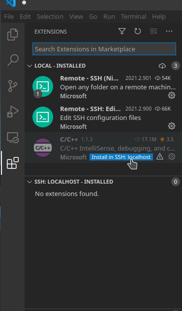

9. **OUVREZ LE TERMINAL**

   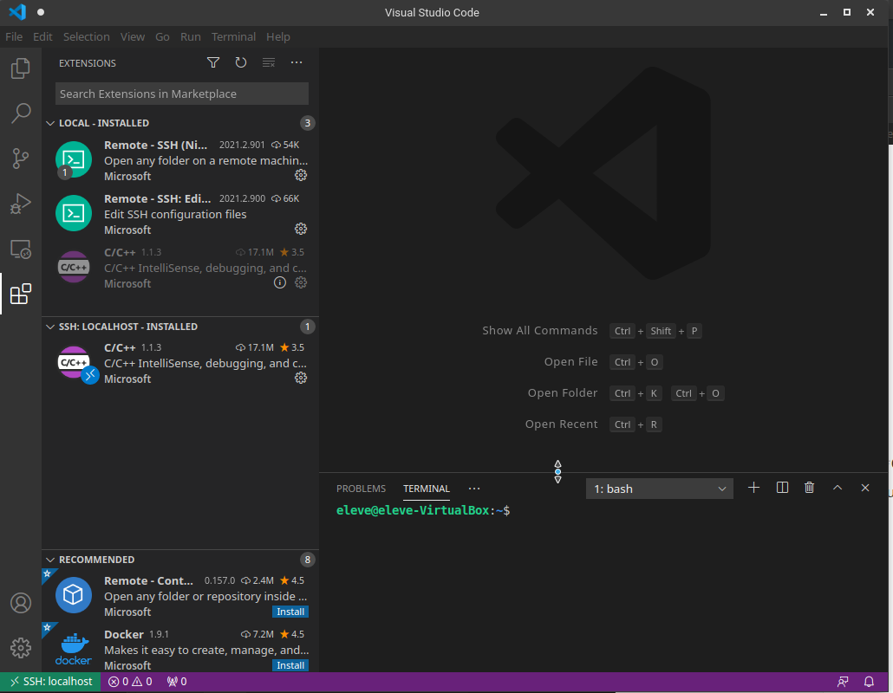

10. **Sur la VM,** créez un dossier de projet comme indiqué quand la consigne du sujet du test.

11. Ouvrez un dossier de projet avec VSCode

    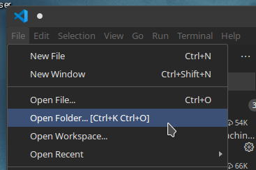

12. Copier le contenu de project_folder dans le dossier du projet.

13. Codez.

# 4. Nettoyer les traces

## Linux

**TOUT TRAVAIL NON SAUVEGARDE SERA SUPPRIME DEFINITIVEMENT**

Quitter la VM en restaurant l'instantané.

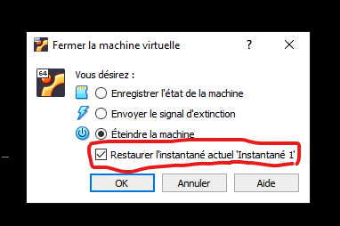

## Windows

Dans le dossier `./injection/cleanup`, exécuter en tant que administrateur `cleanWindows.bat`.